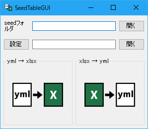
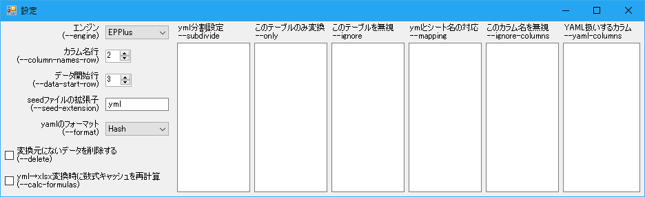
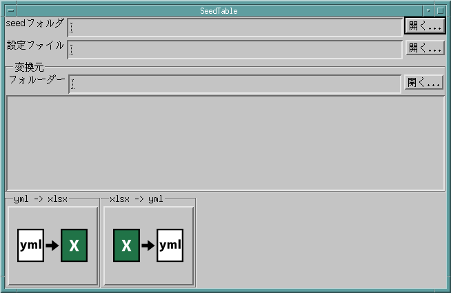

# seedtable

Rails等で扱うseed yaml <-> xlsx を相互変換するツールです。

コマンドライン版とGUI版があります。

[](https://ci.appveyor.com/project/Narazaka/seedtable)
[](https://travis-ci.org/seed-ui/seedtable)

## Motivation

xlsxは個人用単体表計算ソフトとしては優秀ですが、複数人でのデータ入力やプログラムでの扱い、バージョン管理などには超不向きです。
にもかかわらず、これをRailsアプリケーション等のデータ入力ツールとして使うことがしばしば選択肢に上がるようです。
Excelをマスターデータとしたら最後、その不向きな部分の辛さが待っています。

それに対してこのseedtableは、yamlとxlsxの相互変換をすることで、Excelを利用しつつyamlをマスターデータとする運用の道を開きます。
マスターデータはyamlで、Excelはあくまで編集のしやすい表計算UIであるとして運用すれば、複数人管理、プログラム、バージョン管理親和性を損ねないまま、ユーザーフレンドリーなデータ入力を実現することができるのではないかと考えます。

Excelは大きな長所と同時に大きな短所をもち、運用上の扱い方が難しいツールです。
このツールが、そのようなExcelの長所だけを引き出すより良いデータ運用の一助になれば幸いです。

## Features

- データベース等のIDつき二次元データを表すyamlをExcelで編集する為の変換ツールです。
- xlsx -> yaml と yaml -> xlsx の相互変換が可能です。
- 数式セルはxlsx -> yaml変換では計算後の値となります。yaml -> xlsx変換では数式のまま保持されます。
- 行追加がある場合は書式や数式を周辺のものから自動でコピーしますので、入力Excelの1行目に必要な設定を記述しておけばデータの増加にも簡単に対応できます (EPPlusエンジン)。
- 入出力するyamlファイルのIDによる分割に対応しています。
- xlsx -> yamlの変換のみなら似たオプションを持つ[xlsx2seed](https://github.com/Narazaka/xlsx2seed.js)もあります。
  .NET/Monoランタイムをインストールするのが難しい場合などにご利用下さい。

## Requires

Windows: .NET Framework 4.6.1以上

Linux: Mono 4.4以上

Mac: Mono 4.4以上

## Install

[Releases](https://github.com/seed-ui/seedtable/releases)にあるzipをダウンロードして適当な場所に配置して下さい。

- seedtable.zip、XmSeedtable-linux.zip、XmSeedtable-mac.zipのいずれも、全環境で動作するseedtable.exeを含みます。
- seedtable.zipはWindowsで動作するseedtable-gui.exeを含みます（Linux, Macでは設定ダイアログとUIの文字化け以外は正常動作します）。
- XmSeedtable-{linux,mac}.zipはそれぞれLinuxとMacで動作するXmSeedtable.exeを含みます。

## Usage (seedtable.exe)

Monoの場合は`mono seedtable.exe`等として下さい。

```
# xlsx -> yaml
$ seedtable from foo.xlsx -o db/seeds
$ seedtable from foo.xlsx -o db/seeds -O hoges piyos
$ seedtable from foo.xlsx -o db/seeds -S hoges:2
$ seedtable from foo.xlsx -o db/seeds -S 1:hoges
$ seedtable from -i doc foo.xlsx -o db/seeds

# yaml -> xlsx
$ seedtable to -s db/seeds -x doc foo.xlsx -o newdoc
```

オプションの詳細は後のOptionsの節を参照下さい。

## Usage (seedtable-gui.exe)



- seedフォルダ (yaml -> xlsxの変換元、およびxlsx -> yamlの変換先になる)
- 設定 (seedtable.exeのオプション相当 GUIで編集できます)

を入力してから、「yml -> xlsx」、「xlsx -> yml」それぞれをダブルクリックするか、xlsxファイルをドラッグ&ドロップして変換できます。

Linuxでの起動は`mono seedtable-gui.exe`、Macでは`mono --arch=32 seedtable-gui.exe`と32bitを指定して起動してください。

設定ファイルは下記のように、seedtable.exeのオプションのうちinput/output系を除いた長いオプション名をyamlで設定するものです。

```yaml
ignore-columns:
  - dummy
subdivide:
  - "foos:0"
  - "bars:2"
engine: EPPlus
```

GUIの設定ダイアログは以下のようなものです。



この設定をGUIで編集させたくないという場合は、`seedtable-gui.exe`と同じフォルダに`options.readonly`というファイル(中身は空で大丈夫)をおいて下さい。

設定の詳細は後のOptionsの節を参照下さい。

## Usage (XmSeedtable.exe)



seedtable-gui.exeと同じくseedフォルダと設定ファイルを入力します。

変換するExcelファイルを変換元で指定して「yml -> xlsx」、「xlsx -> yml」それぞれをクリックすると変換できます。

Unix系OSとMac OS X等で`mono XmSeedtable.exe`または`mono --arch=64 XmSeedtable.exe`(Mac OS X等)で動作します。

X Serverが必要ですので、Mac OS XではXQuartz 2.7.8をインストールしてください(2.7.9以降では動作しません)。

## Excelファイルの形式

以下のような形式を想定しています。

### Excel

シート名`characters`

|   | A  |  B   |      C      |
|---|----|------|-------------|
| 1 | ID | 名前 |    説明     |
| 2 | id | name | description |
| 3 | 1 | さくら | F.I.R.S.T |
| 4 | 2 | アルル | ボク |
| 5 | 3 | さっちゃんさん | 髪が長い |

### YAML

`characters.yml`

```
data1:
  id: 1
  name: さくら
  description: F.I.R.S.T
data2:
  id: 2
  name: アルル
  description: ボク
data3:
  id: 3
  name: さっちゃんさん
  description: 髪が長い
```

デフォルトではExcel表の2行目がカラム名、3行目以降がデータとして扱われますが、これらはそれぞれ`--column-names-row`、`--data-start-row`オプションで変更可能です。

## Options

コマンドラインオプションと対応するGUIでの設定名です。

### 共通

#### --engine エンジン

Excel変換エンジンの設定です。

seedtableではxlsxファイルを扱うバックエンドとして複数のライブラリを選択できます。

| ライブラリ | from (xlsx -> yaml) | to (yaml -> xlsx) |
|---|---|---|
| OpenXml | 速い | 行挿入削除× |
| EPPlus | 速い | 行挿入削除〇 |
| ClosedXML | 遅い 一部数式を含むxlsxはエラー | 行挿入削除× スタイルが保存されない |

OpenXmlとEPPlusのfrom処理速度はほぼ同じですが、ファイルによって3割程度の速度差がある場合があります。
ClosedXMLはその2倍以上程度の時間がかかります。

EPPlus(デフォルト)がおすすめです。

#### --config 設定ファイル

設定ファイルを使ってオプションを決めます。

コマンドラインオプションのうちinput/output系のオプション以外は無視され、設定ファイルのものが常に使われます。

設定ファイルは下記のように、seedtable.exeのオプションのうちinput/output系を除いた長いオプション名をyamlで設定するものです。

```yaml
ignore-columns:
  - dummy
subdivide:
  - "foos:0"
  - "bars:2"
engine: EPPlus
```

seedtable-gui.exe、XmSeedtable.exeと共通の形式です（GUIで設定可能です）。

#### --subdivide yml分割設定

xlsx -> yaml (from) 変換で出力するseedファイルをID単位ごとに分割できます。

分割しておくと、複数人で同時に別のIDのデータを編集してコミットする等の場合に、コンフリクトがおこりにくくなります。

`(前削除桁数:)(xlsxファイル名/)seedテーブル名(:後削除桁数)(@その他のオプション)`の形式で指定します。（複数指定はコマンドラインでは`,`区切り・GUIでは改行区切り）

xlsxファイル名を指定する場合はパスを含まずファイル名のみ（path/to/foo.xlsxではなくfoo.xlsx）で指定してください。

その他のオプション:

- @fromまたは@to: それぞれxlsx -> yaml (from) 変換、yaml -> xlsx (to) 変換のみでそのオプションが有効になります
- @key=プライマリキー名: プライマリキーを"id"以外にします
- @column-names-row=数値: --column-names-row をテーブル個別指定
- @data-start-row=数値: --data-start-row をテーブル個別指定

ID(プライマリキーを指定した場合はそのカラム)数値の桁を上の方から前削除桁数分、下の方から後削除桁数分削ったものがファイル名として使われます。

例:

| 指定 | 存在するID | 作られるファイルと含まれるID |
|------|------------|------------------|
| table:2 | 101, 111, 201, 202, 1001, 1002 | data1(101, 111), data2(201, 202), data10(1001, 1002) |
| 2:table | 10100, 20100, 10200, 20200, 101, 102 | data100(10100, 20100), data200(10200, 20200), data1(101), data2(102) |
| 1:table:1 | 111, 211, 112, 212, 121, 221 | data1(111, 211, 112, 212), data2(121, 221) |
| table:0 | 1, 2, 3, 10, 11, 12 | data1(1), data2(2), data3(3), data10(10), data11(11), data12(12) |

テーブル名はワイルドカードで指定できます。

重複する指定がある場合は、通常のテーブル名→ワイルドカードを使ったテーブル名→`*`の優先順位でマッチします。

xlsxファイル名を指定した場合は、通常のテーブル名のうち通常のファイル名→ワイルドカードを使ったファイル名→`*`、ワイルドカードを使ったテーブル名のうち通常のファイル名→ワイルドカードを使ったファイル名→`*`、`*`と指定されたテーブル名のうち通常のファイル名→ワイルドカードを使ったファイル名、という優先順位でマッチします。

yaml -> xlsx (to) 変換においてこの指定は考慮されません。指定にかかわらず自動判定して読み取ります。

#### --only このテーブルのみ変換

指定テーブルのみ変換します。

上記のsubdivideの設定を同時に記述できます。

`@from`または`@to`をつけたものはそれぞれxlsx -> yaml (from) 変換、yaml -> xlsx (to) 変換のみで有効になります。

#### --ignore このテーブルを無視

指定テーブルを無視します。

onlyに指定があってもこちらに該当すれば無視されます。

テーブル名は上記のsubdivideの設定と同じようにワイルドカードで指定できます。

`@from`または`@to`をつけたものはそれぞれxlsx -> yaml (from) 変換、yaml -> xlsx (to) 変換のみで有効になります。

#### --primary 優先シート

複数ファイルに同名シートが存在する場合、どのファイルのシートを変換するかを指定します。

`xlsxファイル名/seedテーブル名`の形式で指定します。（複数指定はコマンドラインでは`,`区切り・GUIでは改行区切り）

#### --mapping ymlとシート名の対応

ymlファイル名とxlsxのシート名が同一でない場合の対応を指定します。

`ymlファイル名:(xlsxファイル名/)xlsxシート名`の形式で指定します。（複数指定はコマンドラインでは`,`区切り・GUIでは改行区切り）

この指定がある場合、--subdivide、--only、--ignore、--primaryはxlsxシート名ではなくymlファイル名側での指定となりますのでご注意下さい。

- 例: xlsxのシート名31文字上限に引っかかった場合の利用 `very_long_long_long_long_table_names:VL4table_names`
- 例: 何らかの原因で同じシート名にしなければならない場合 `foos:foos.xlsx/contents,bars:bars.xlsx/contents`

#### --alias エイリアスシート名

ymlファイルのテーブルを別名のシートに反映します。

`ymlファイル名:(xlsxファイル名/)xlsxシート名`の形式で指定します。（複数指定はコマンドラインでは`,`区切り・GUIでは改行区切り）

同じyml名に対して複数のシート名が指定できます。

from変換時に指定すると、指定されたxlsxシート名の変換がスキップされます。

主にテーブル外部参照したい場合に役立つ機能です。

例えばカラム値`content_type: Foo`で`foos`テーブルを参照したいなどの場合に、Excel関数でパスカルケース→スネークケース変換をしなくても、`--alias foos:Foo`としてやれば、`VLOOKUP(D10, INDIRECT(C10&"!$A$3:$B$10000"), 2)`などで普通に参照できるようになります。

#### --yaml-columns YAML扱いするカラム

指定のカラム値をYAMLとして取り扱います。ワイルドカードで指定できます。

例えばdata_yamlカラムを--yaml-columnsに指定すると下記のような変換が行われます。

xlsx:

| id | data_yaml |
|----|-----------|
|  1 |  [ 1, 2 ] |

yaml:

```yaml
data1:
  id: 1
  data_yaml:
    - 1
    - 2
```

yaml -> xlsx (to) 処理においてこの指定は考慮されません。指定にかかわらず自動判定して読み取ります。

#### --ignore-columns このカラム名を無視

指定されたカラム名を無視して入出力します。ワイルドカードで指定できます。

例えば関連テーブル情報カラムをymlには出したくない時などに使えます。

例: `--ignore-columns dummy`を指定してdummyカラムに参照情報を出す

|   |  A |    B   |     C     |   D   |
|---|----|--------|-----------|-------|
| 1 | ID |   Foo  | Fooのname | value |
| 2 | id | foo_id |   dummy   | value |
| 3 | 101 | 1 | =VLOOKUP(B3, foos!$A$1:$B$2, 2) | 1 |
| 4 | 102 | 1 | =VLOOKUP(B4, foos!$A$1:$B$2, 2) | 2 |
| 5 | 201 | 2 | =VLOOKUP(B5, foos!$A$1:$B$2, 2) | 1 |
| 6 | 202 | 2 | =VLOOKUP(B6, foos!$A$1:$B$2, 2) | 2 |

ここに指定が無くても、xlsxシート上に無いカラムは無視されます。

#### --format yamlのフォーマット

`Hash`と`Array`が選べます。

`Hash`の場合

```yaml
data1:
  id: 1
  value: foo
```

`Array`の場合

```yaml
- id: 1
  value: foo
```

という形式で出力されます。

yaml -> xlsx (to) 変換においてこの指定は考慮されません。指定にかかわらず自動判定して読み取ります。

#### --column-names-row カラム名行

yamlのカラム名と対応するxlsxシート行番号です。デフォルトは2です。

#### --data-start-row データ開始行

データが開始するxlsxシート行番号です。デフォルトは3です。

#### --delete 変換元にないデータを削除する

##### xlsx -> yaml (from) 変換時

subdivide設定がある場合、分割された`*.yml`ファイルを一旦全部消してから新たに出力します。

##### yaml -> xlsx (to) 変換時

seedとして読み込んだymlにないIDの行をxlsxシート上から削除します（EPPlusエンジンでのみ動作します）。

#### --seed-extension seedファイルの拡張子

この拡張子でyamlを入出力します。

#### --require-version

未実装です。

#### --version-column

未実装です。

### xlsx -> yaml 変換時 (from)

#### --input

xlsx入力ディレクトリ

#### --output

yml出力ディレクトリ

### yaml -> xlsx 変換時 (to)

#### --seed-input

yml入力ディレクトリ

#### --xlsx-input

xlsx入力ディレクトリ

#### --output

xlsx出力ディレクトリ

#### --calc-formulas yml→xlsx変換時に数式キャッシュを再計算する

Excelは数式セルの計算結果値をファイルに書き込んでいて、本ソフトも含めて多くのプログラムはセルの値としてその結果値を使っています。

それと同じように数式セルの値を再計算して即値として書き込んでから出力xlsxを保存します。

データ量が多いと処理時間が著しく長くなります。

本ソフトの一般的なユースケースであろう「ymlをxlsxに変換してExcelで編集して再びymlに書き戻す」場合には、
Excelは数式結果値がなくとも再計算してくれますし、保存時点で上記処理が走るので、このオプションを有効にしなくても問題ありません。

しかし本ソフトで出力したxlsxファイルを何らかの理由で直接Excel以外のソフトで扱いたいという場合には、このオプションを有効にしないと数式入りxlsxについて正しく動かないケースがあります。

ただ、一般的にxlsxファイルを扱うよりソースのymlファイルを扱った方がなにかと便利でしょうし、処理時間の問題もあるのでこのオプションを使うケースをそもそもおすすめしません。

## Tips

### セル範囲指定の制限

EPPlusで`A:A`等行指定のないセル範囲指定は正しく変換できません。実用範囲で`A1:A10000`等として下さい。

### 外部シート参照

foo_barsテーブルからfoosテーブルの中身をVLOOKUPで参照したいが編集xlsxファイルは分けたい場合、以下のようにするとExcelの外部シート参照機能を使わずにseedtableで完結させることができます。

foos.xlsxにfoosテーブル、foo_bars.xlsxにfoo_barsテーブルとfoosテーブルを作り、まず下記のようにyaml -> xlsx (to) 変換します。

```
seedtable to foos.xlsx bars.xlsx --seed-input seeds
```

すると例えば下記のようにデータが入ります。

foos.xlsx/foos

|   |  A |   B  |   C   |
|---|----|------|-------|
| 1 | ID | 名前 |   値   |
| 2 | id | name | value |
| 3 |  1 |  n1  |   v1  |

foo_bars.xlsx/foo_bars

|   |  A |   B  |   C   |
|---|----|--------|----------|
| 1 | ID | fooのID | 名前 |
| 2 | id | foo_id | foo_name |
| 3 |  1 |    1   | VLOOKUP(B3,foos!$A$3:$B$100, 2) |

foo_bars.xlsx/foos (参照しないカラムは省いて良い)

|   |  A |   B  |
|---|----|------|
| 1 | ID | 名前 |
| 2 | id | name |
| 3 |  1 |  n1  |

foo_bars.xlsx/foo_barsにあるfoosテーブルへの参照が、Excelの外部参照機能を使わずに可能になっています。

これを適当に編集し、下記のようにfoos.xlsx/foosを優先シートとしてxlsx -> yaml (from) 変換すれば、適切なfoosテーブルとfoo_barsテーブルのデータが得られます。

```
seedtable from foos.xlsx bars.xlsx --output seeds --primary foos.xlsx/foos
```

seedtable-gui.exeなどGUIクライアントを用いるときは、当該の--ignore（このテーブルを無視）オプションがxlsx -> yaml (from) 変換時のみ無視されるように、`foo_bars.xlsx/foos@from`を指定してください。

## Contribute

バグ報告や要望等は[Issues](https://github.com/seed-ui/seedtable/issues)にお願いいたします。

[プルリク](https://github.com/seed-ui/seedtable/pulls)もざっくりお待ちしています。

ただし仕事の合間対応なので反応速度ははやいとは限りません。

## Build

### seedtable.exe / seedtable-gui.exe

普通にseedtable.slnを開いてnugetパッケージの復元してからビルドすれば通ると思います。

### XmSeedtable.exe

Xlib、OpenMotif、libxpm等に依存します。詳細は[.travis.yml](.travis.yml)などを参照ください。

```
git submodule init
git submodule update
nuget restore
cd seedtable-x11
nuget restore
```
等したのち`seedtable-x11/TonNurako/TonNurakoEx/Config.mp3`を`seedtable-x11/TonNurako/TonNurakoEx/Site.mp3`へコピーして、include先を適切なパスへ書き換え、`seedtable-x11`ディレクトリ内でxbuildを叩いてください。

## License

このソフトウェアにはApache Licenseのもとで頒布されているソフトウェアOpen-XML-SDKと、LGPLのもとで頒布されているソフトウェアEPPlus、TonNurakoが使われています。

このソフトウェアは[MIT License](https://narazaka.net/license/MIT?2017)のもとでリリースされています。
